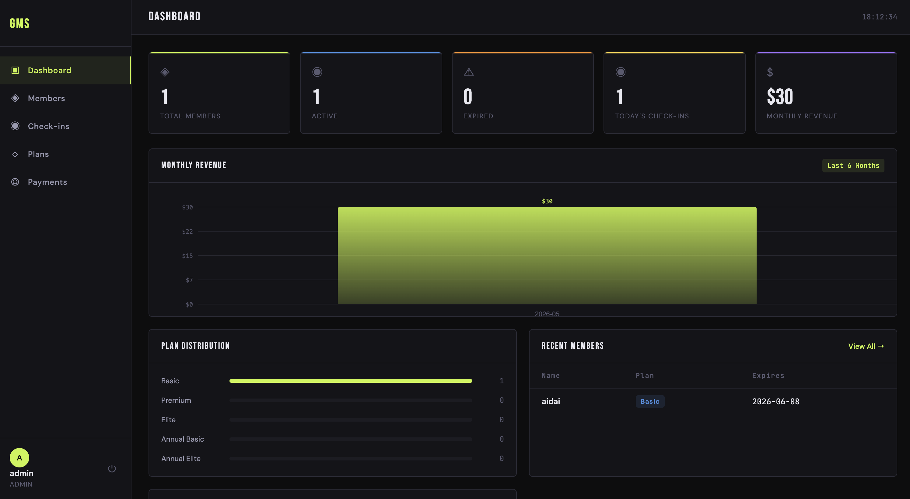
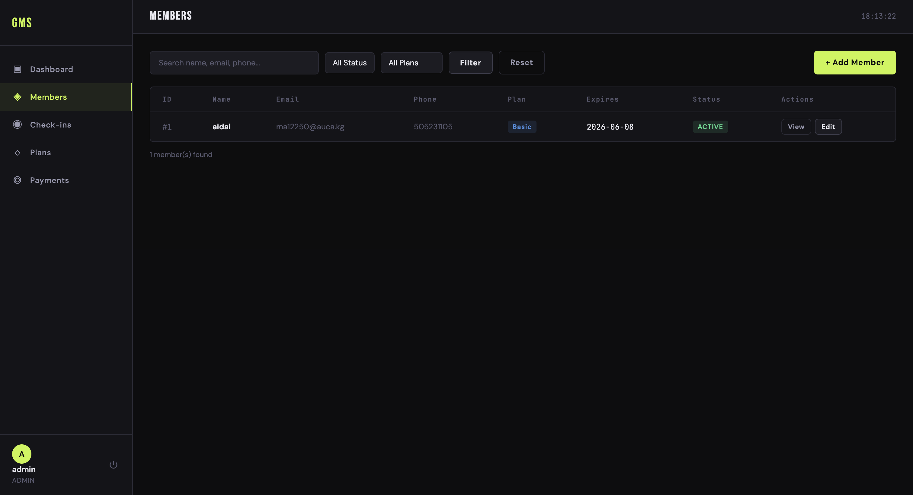
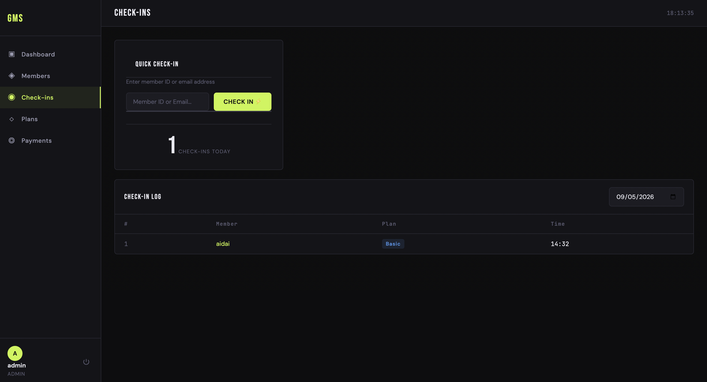

# Gym Membership System

> A full-stack web application for managing gym members, memberships, check-ins, and payments — built with Python (Flask) and SQLite.

---

## Problem It Solves

Many small gyms still track members using spreadsheets or paper records, which makes it slow and error-prone to manage memberships, renewals, and daily check-ins. This system replaces that with a clean, fast web dashboard accessible from any browser.

---

##  Features

-  **Authentication** — Secure admin login with hashed passwords
-  **Dashboard** — Live stats: total members, active, expired, today's check-ins, monthly revenue + bar chart
-  **Member Management** — Full CRUD: add, view, edit, delete members; search and filter by plan or status
-  **Membership Plans** — Create and manage pricing plans with features and duration
-  **Check-in System** — Log member visits by ID or email with live autocomplete
-  **Payment Tracking** — Automatic payment records on join and renewal
-  **Renewal System** — Extend memberships with correct expiry calculation

---

## 🏗 Architecture Overview

```
Browser (Client)
     │
     │  HTTP Requests
     ▼
Flask Web Server (app.py)
     │
     ├── Jinja2 Templates (HTML rendering)
     ├── Static Files (CSS + JS)
     │
     ▼
SQLite Database (gym.db)
     │
     ├── users
     ├── members
     ├── plans
     ├── checkins
     └── payments
```

The app follows the **MVC pattern**:
- **Model** — SQLite tables accessed via Python's `sqlite3`
- **View** — Jinja2 HTML templates with custom CSS/JS
- **Controller** — Flask routes in `app.py`

---

##  Tech Stack

| Layer      | Technology                          |
|------------|-------------------------------------|
| Backend    | Python 3, Flask 3.x                 |
| Database   | SQLite (built-in `sqlite3`)         |
| Frontend   | HTML5, CSS3, Vanilla JavaScript     |
| Templating | Jinja2                              |
| Auth       | Werkzeug password hashing, sessions |
| Fonts      | Bebas Neue, DM Sans, JetBrains Mono |

---

##  Project Structure

```
gym_membership_system/
├── app/
│   ├── app.py              # Flask routes and database logic
│   ├── static/
│   │   ├── css/style.css   # Full design system (dark industrial theme)
│   │   └── js/main.js      # Chart renderer, animations, autocomplete
│   └── templates/          # Jinja2 HTML templates (10 pages)
├── docs/                   # Screenshots
├── slides/                 # Pitch presentation
├── requirements.txt
├── .gitignore
└── README.md
```

---

## ⚙Setup & Run Instructions

### 1. Clone the repository
```bash
git clone https://github.com/YOUR_USERNAME/gym_membership_system.git
cd gym_membership_system
```

### 2. Create a virtual environment
```bash
python -m venv .venv

# macOS/Linux
source .venv/bin/activate

# Windows
.venv\Scripts\activate
```

### 3. Install dependencies
```bash
pip install -r requirements.txt
```

### 4. Run the app
```bash
cd app
python app.py
```

### 5. Open in browser
```
http://127.0.0.1:5000
```

### Default login
| Username | Password  |
|----------|-----------|
| `admin`  | `admin123`|

---

## 🗄️ Database Schema

```sql
users    (id, username, password, role)
plans    (id, name, price, duration_days, features)
members  (id, full_name, email, phone, join_date, expiry_date, plan_id, status, notes)
checkins (id, member_id, checkin_at)
payments (id, member_id, plan_id, amount, payment_date, status)
```

---

##  Screenshots


| Dashboard | Members | Check-in |
|-----------|---------|----------|
|  |  |  |

---

##  Demo Video

>  Link to the drive:
> https://drive.google.com/drive/u/1/folders/1cbL8yM6sjmW9HYPr47kknuNxzVP5Xu4K

---

##  Dependencies

```
flask>=3.0.0
werkzeug>=3.0.0
```

All other modules (`sqlite3`, `datetime`, `os`) are part of Python's standard library.

---

##  Author

**Aidai Mamyrova** — AUCA, Introduction to Web Programming, Spring 2026